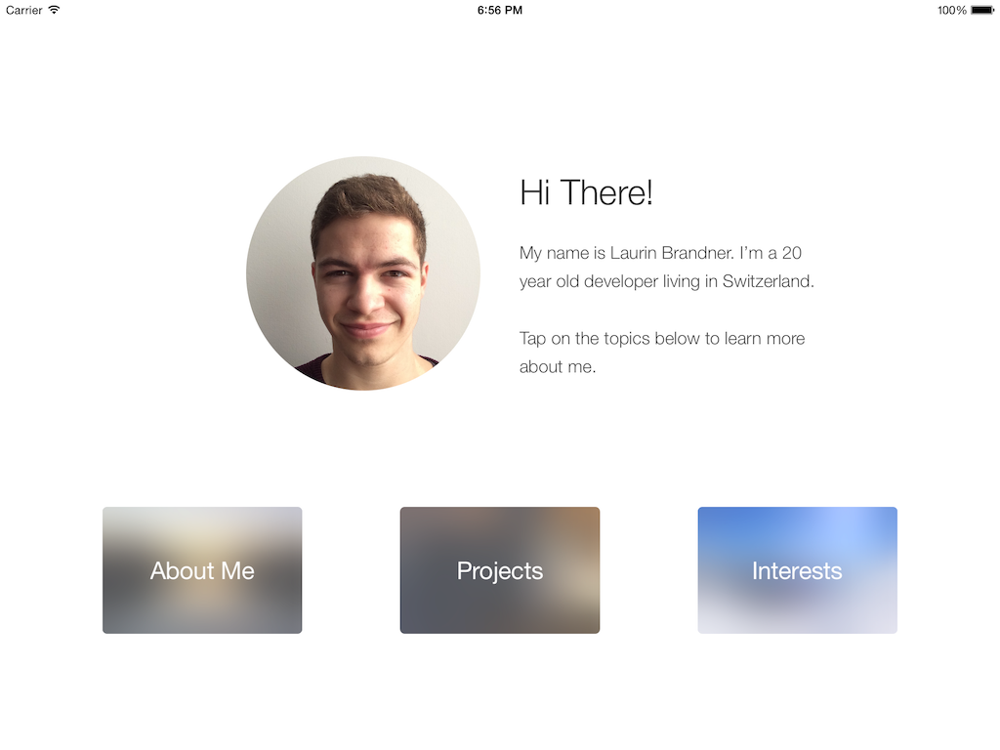
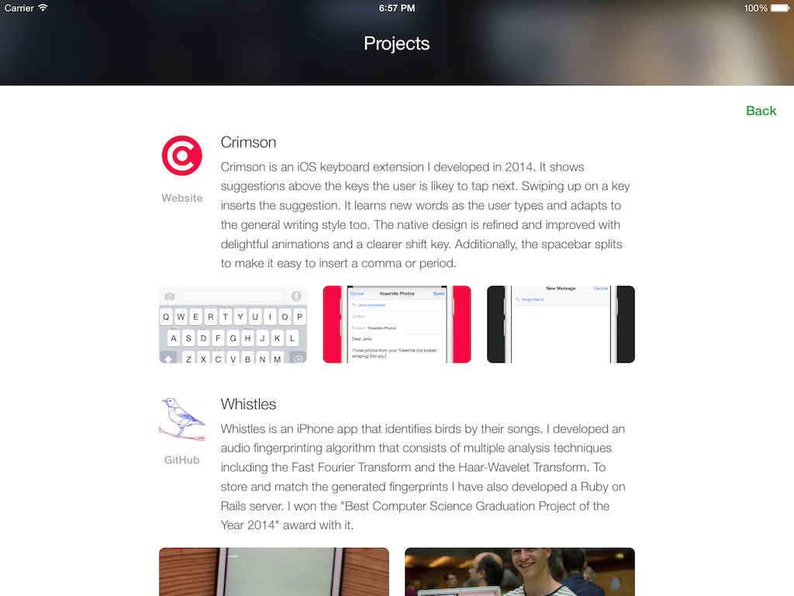
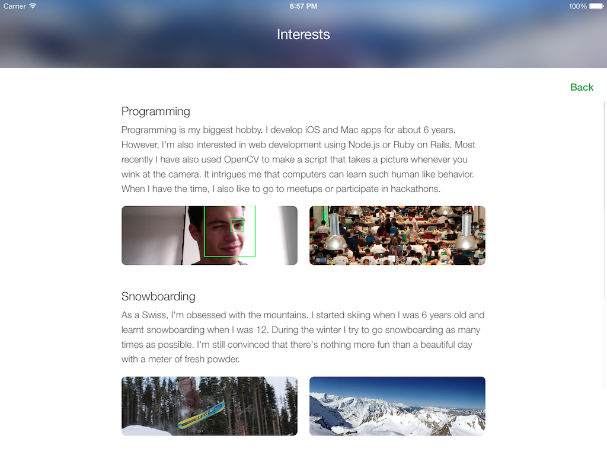

# Scholarship
This is an iPad app that I use as a resume to apply for scholarship conferences. I won both the WWDC and UIKonf with it. I wrote this in February when ReactiveCocoa wasn't supporing Swift yet, so the code is not particularly beautiful. Feel free to use the source code but please don't use the app as it is.

## Contact
Mention me on [twitter](https://twitter.com/lbrndnr) or visit my [website](http://laurinbrandner.ch).
